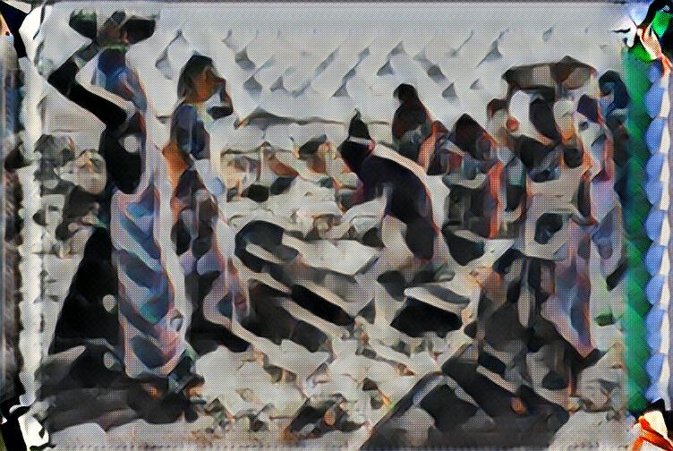

# tensorflow (Python 2.7 / 3.5)

This repo contains my tensorflow codes

## MNIST  <br />
   - mnist training - python mnist_train.py <br />
  Required training and test/validation data is automatically downloaded by code. <br />
   - mnist test - python mnist_test.py <br />
  Image input as arg (not yet implemented, arg for input image, change in code for now)

## EMOTION <br />
   - emotion training - python emo_train.py <br />
 Required training and test/validation data can be downloaded from  <br />
      * https://inclass.kaggle.com/c/facial-keypoints-detector/data --> ./data/
  Image input as arg (not yet implemented, arg for input image, change in code for now)
  
## VGG19-STYLE-TRANSFER FOR IMAGE (Python 3.5, Tensorflow LATEST)
   - Download model weights from http://www.vlfeat.org/matconvnet/models/beta16/imagenet-vgg-verydeep-19.mat <br />
   - VGG19 STYLE TRANSFER can be executed by - <br />
```
python style-transfer-main.py  --style ./imgstyle/StyleImage.jpg --content ./imgcontent/ContentImage.jpg --out ./output/ --epochs 100000 --print-iterations 100 --learning-rate 10
```
   - VGG19 Style Transfer can be also executed by <b> vgg19-style-transfer/Style_Transfer.ipynb </b> IPYTHONG NOTEBOOK
      * Please change values for <b> --epochs </b> and <b> --print-iterations </b> as per your requirement.

<p align = 'center'>


<a href = 'vgg19-style-transfer/output/out.jpg'></a>
</p>

## VGG19-STYLE-TRANSFER FOR VIDEO (Python 3.5, Tensorflow LATEST)
   * https://arxiv.org/abs/1708.04538 <br />
   * Download model weights from http://www.vlfeat.org/matconvnet/models/beta16/imagenet-vgg-verydeep-19.mat <br />
   * Download COCO training images from http://msvocds.blob.core.windows.net/coco2014/train2014.zip <br />
   * Trained model to download https://drive.google.com/file/d/1cr3S_1GNLLkAtpJ1Cnf0HJi1aZmMUT8i/view?usp=sharing
      
   ### * Training
```
python style-transfer-Noise-train.py --style imgstyle\udnie.jpg --chkpnt chkpnt_udnie_batch_16\ --test-image testImage\Kishwar.jpg --print-iterations 500 --chkpnt-iterations 2000 --epochs 3 --learning-rate 0.001 --batch-size 16 --content D:\train2014\train2014\
```

   ### * Testing (Image)
```
python style-transfer-Noise-test.py --chkpnt chkpnt_udnie_batch_16\ --cam-url 255 --in-path testImage\ContentImage.jpg --out-path output\Output.jpg
```
<p align = 'center'>


<a href = 'vgg19-style-transfer-video/output/Output.jpg'></a>
</p>

   ### * Testing (Video) - Using IP Camera
```
python style-transfer-Noise-test.py --chkpnt chkpnt_udnie_batch_16\ --cam-url http://192.168.0.3:8080/video/
```

   ### * Testing (Video) - Using Laptop Camera
```
python style-transfer-Noise-test.py --chkpnt chkpnt_udnie_batch_16\ --cam-url 0
```

## TRIGGER WORD LILLY (Python 3.5, Tensorflow LATEST)

- Code generates required training data from given positive, negative and background samples.
- Total number of 2000 samples are generated
- Model output at 97.91% accuracy: <b> rnn-trigger-word-lilly/keras/raw_data/chime/chime_output.wav </b>
- Trained model: <b> rnn-trigger-word-lilly/keras/raw_data/chime/chimModel_loss_0_0715.h5 [loss - 0.0715] </b>
- MODEL
<p align = 'center'>

</p>

## VOICE CONTROLLED CAR (Python 3.5, Tensorflow LATEST, Keras LATEST)
 Youtube video can be found at [Youtube](https://www.youtube.com/watch?v=X7tyBVSACUM) <br>
 
 - Step 1: Generate New data using <b>Generate_Voice_Data.py</b> <br>
   - Before running / executing file please change <br>
   ```WAVE_OUTPUT_FILENAME = "data/right/file-right-t-"```  --> Example for keyword "RIGHT"
   - Please create required directories manually as code will not generate any directory. <br>
   
 - Step 2: Update <b>config.ini</b> with correct path and keywords. <br>
 - Step 3: Run <b>Voice-Controlled-Car.ipynb</b> to start training. <br>
 - Step 4: Save model after training. <br>
 - Step 5: Change IP to correct IP of car in <b>Test-Voice-Control-Car-Model.py</b>.
 
 ##### Please note that with current data, model doesn't produce good result. 
 
## STYLE-TRANSFER FOR MUSIC (Python 3.5, Tensorflow LATEST) - Expected to be finished 30/06/2018
   - NEXT IN QUEUE..

## STYLE-TRANSFER FOR AUDIO - VOICE CLONING (Python 3.5, Tensorflow LATEST) - Expected to be finished 30/11/2018
   - IN QUEUE
   
