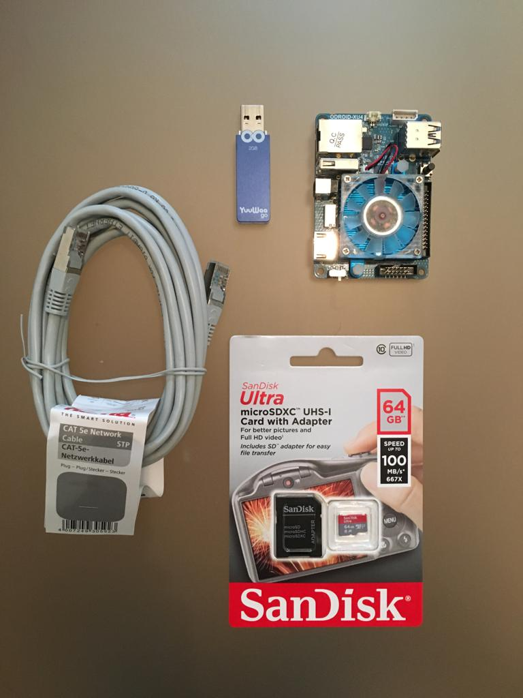

# Tensorflow on Odroid XU4

To build Tensorflow on Odroid XU4, we will need following hardware.

- Odroid XU4 board
- SD Card / eMMC
- Network cable
- USB (Swap memory)
- Monitor (Optional)
- Keyboard and Mouse (Optional)

### Step 1: Format SD Card
We need to format SD card because without formatting it, we may not get all available space for OS. I am using software available on https://www.sdcard.org/downloads/formatter_4/eula_mac/
