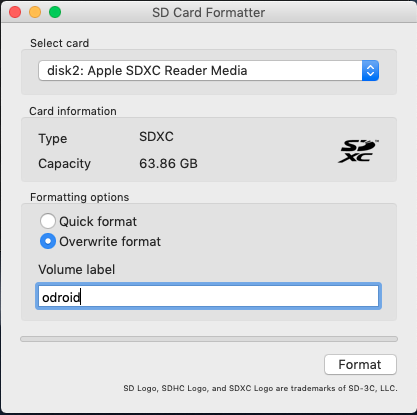
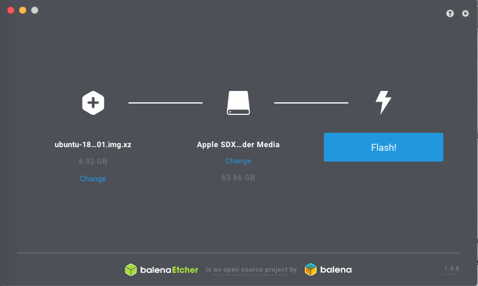
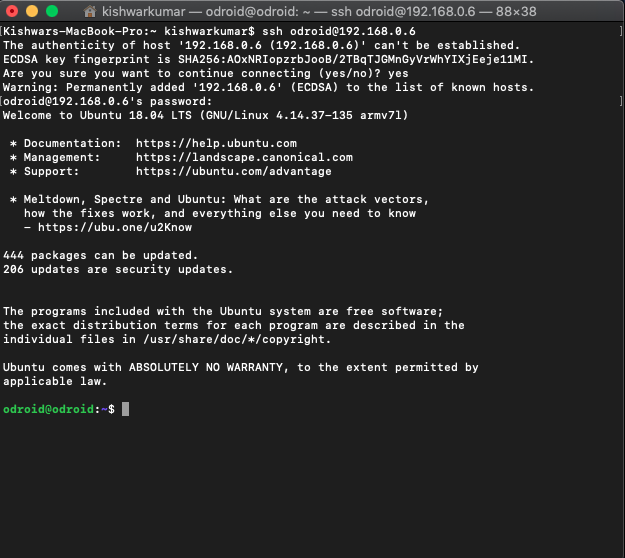

# Tensorflow on Odroid XU4 (Unstable, See SECTION STABLE)

## SECTION UNSTABLE
### To build Tensorflow on Odroid XU4, we will need following hardware.

- Odroid XU4 board
- SD Card / eMMC
- Network cable
- USB (Swap memory)
- Monitor (Optional)
- Keyboard and Mouse (Optional)

<p align = 'center'>

</p>

### Step 1: Format SD Card
We need to format SD card because without formatting it, we may not get all available space for OS. I am using software available on https://www.sdcard.org/downloads/formatter_4/eula_mac/
<p align = 'center'>

</p>

### Step 2: Download OS for Odroid XU4
We can download OS from https://wiki.odroid.com/odroid-c1/os_images/ubuntu/v3.0 (https://east.us.odroid.in/ubuntu_18.04lts/ubuntu-18.04-4.14-mate-odroid-xu4-20180501.img.xz)

### Step 3: Load OS on SD Card
We will use <b>Balena Etcher</b> to load OS image on SD Card. Balena Etcher is available on http://etcher.io
<p align = 'center'>

</p>

### Step 4: Let's get into the Odroid using SSH
<p align = 'center'>

</p>

### Step 5: Execute some basic commands required for Odroid XU4
```
sudo apt install libnfs11
sudo apt update
sudo apt upgrade
sudo apt dist-upgrade
sudo reboot
```

### Step 6.1: Preprocessing for Bazel (Build tool for Tensorflow)
Before we build Bazel, run following commands
```
sudo apt-get install pkg-config zip g++ zlib1g-dev unzip default-jdk autoconf automake libtool

# For Python 2.7
sudo apt-get install python-pip python-numpy swig python-dev
sudo pip install wheel

# For Python 3.3+
sudo apt-get install python3-pip python3-numpy swig python3-dev
sudo pip3 install wheel
```
We will use gcc and g++ version 4.8 to build bazel
```
sudo apt-get install gcc-4.8 g++-4.8
sudo update-alternatives --install /usr/bin/gcc gcc /usr/bin/gcc-4.8 100
sudo update-alternatives --install /usr/bin/g++ g++ /usr/bin/g++-4.8 100
```
Check gcc and g++ versions before proceeding further.
```
odroid@odroid:~$ gcc --version
gcc (Ubuntu/Linaro 4.8.5-4ubuntu8) 4.8.5
Copyright (C) 2015 Free Software Foundation, Inc.
This is free software; see the source for copying conditions.  There is NO
warranty; not even for MERCHANTABILITY or FITNESS FOR A PARTICULAR PURPOSE.

odroid@odroid:~$ g++ --version
g++ (Ubuntu/Linaro 4.8.5-4ubuntu8) 4.8.5
Copyright (C) 2015 Free Software Foundation, Inc.
This is free software; see the source for copying conditions.  There is NO
warranty; not even for MERCHANTABILITY or FITNESS FOR A PARTICULAR PURPOSE.
```
To build Bazel, we need JDK 8. Odroid Ubuntu Mate comes with JDK 10. We need to first uninstall it.
```
sudo apt purge openjdk-*
```
Install JDK 8
```
sudo apt install openjdk-8-jdk
```
Check java and javac version.
```
odroid@odroid:~/Desktop$ javac -version
javac 1.8.0_191
odroid@odroid:~/Desktop$ java -version
openjdk version "1.8.0_191"
OpenJDK Runtime Environment (build 1.8.0_191-8u191-b12-0ubuntu0.18.04.1-b12)
OpenJDK Client VM (build 25.191-b12, mixed mode)
```

### Step 6.2: Adding swap memory
Install htop to check swap memory attached with Odroid
```
sudo apt install htop
```
First, put insert your USB drive, and find the /dev/XXX path for the device.
```
sudo blkid
```
As an example, my drive's path was /dev/sda1

Flag your device to be swap:
```
sudo mkswap /dev/XXX
```
Copy the UUID associated with /dev/XXX
Now edit your /etc/fstab file to register your swap file.
```
sudo nano /etc/fstab
```
On a separate line, enter the following information. Replace the X's with the UUID (without quotes)
```
UUID=XXXXXXXX-XXXX-XXXX-XXXX-XXXXXXXXXXXX none swap sw,pri=5 0 0
```
Save /etc/fstab, exit your text editor, and run the following command:
```
sudo swapon -a
```
Ok, we have added swap memory. To check run <b>htop</b>. In <b>Swp</b>, you should now have some memory size.

### Step 6.3: Get Bazel
```
wget https://github.com/bazelbuild/bazel/releases/download/0.15.0/bazel-0.15.0-dist.zip
unzip -d bazel bazel-0.15.0-dist.zip
```
Once it's done downloading and extracting, we can move into the directory to make a few changes:
```
cd bazel
sudo chmod u+w ./* -R
```
We need to update Java heap size before building bazel. Edit scripts/bootstrap/compile.sh
```
nano scripts/bootstrap/compile.sh
```
Update
```
  run "${JAVAC}" -classpath "${classpath}" -sourcepath "${sourcepath}" \
      -d "${output}/classes" -source "$JAVA_VERSION" -target "$JAVA_VERSION" \
      -encoding UTF-8 "@${paramfile}"
```
To
```
  run "${JAVAC}" -classpath "${classpath}" -sourcepath "${sourcepath}" \
      -d "${output}/classes" -source "$JAVA_VERSION" -target "$JAVA_VERSION" \
      -encoding UTF-8 "@${paramfile}" -J-Xmx500M
```
Save file and exit. 

### Step 6.4: Build Bazel (~35 Minutes)
```
./compile.sh
```
After build finishes, run following command
```
sudo cp output/bazel /usr/local/bin/bazel
```
To make sure it's working properly, run ```bazel``` on the command line and verify it prints help text. Note: this may take 5-10 seconds to run, so be patient!
```
odroid@odroid:~/Desktop/bazel$ bazel
Extracting Bazel installation...
Starting local Bazel server and connecting to it...
........................................
                                              [bazel release 0.15.0- (@non-git)]
Usage: bazel <command> <options> ...

Available commands:
  analyze-profile     Analyzes build profile data.
  build               Builds the specified targets.
  canonicalize-flags  Canonicalizes a list of bazel options.
  clean               Removes output files and optionally stops the server.
  coverage            Generates code coverage report for specified test targets.
  cquery              Loads, analyzes, and queries the specified targets w/ configurations.
  dump                Dumps the internal state of the bazel server process.
  fetch               Fetches external repositories that are prerequisites to the targets.
  help                Prints help for commands, or the index.
  info                Displays runtime info about the bazel server.
  license             Prints the license of this software.
  mobile-install      Installs targets to mobile devices.
  print_action        Prints the command line args for compiling a file.
  query               Executes a dependency graph query.
  run                 Runs the specified target.
  shutdown            Stops the bazel server.
  test                Builds and runs the specified test targets.
  version             Prints version information for bazel.

Getting more help:
  bazel help <command>
                   Prints help and options for <command>.
  bazel help startup_options
                   Options for the JVM hosting bazel.
  bazel help target-syntax
                   Explains the syntax for specifying targets.
  bazel help info-keys
                   Displays a list of keys used by the info command.
```
Now come out of bazel direcotry
```
cd ..
```

### Step 7: Remove GCC and G++ installed for Bazel and install latest versions
```
sudo apt-get purge g++* gcc*
sudo apt-get purge g++ gcc
sudo apt-get purge gcc-4.8 g++-4.8
sudo apt-get install g++ gcc

odroid@odroid:~/Desktop/tensorflow$ gcc --version
gcc (Ubuntu/Linaro 7.3.0-27ubuntu1~18.04) 7.3.0
Copyright (C) 2017 Free Software Foundation, Inc.
This is free software; see the source for copying conditions.  There is NO
warranty; not even for MERCHANTABILITY or FITNESS FOR A PARTICULAR PURPOSE.

odroid@odroid:~/Desktop/tensorflow$ g++ --version
g++ (Ubuntu/Linaro 7.3.0-27ubuntu1~18.04) 7.3.0
Copyright (C) 2017 Free Software Foundation, Inc.
This is free software; see the source for copying conditions.  There is NO
warranty; not even for MERCHANTABILITY or FITNESS FOR A PARTICULAR PURPOSE.
```

### Step 8: Tensorflow r1.11 (Python 3.6)
Let's install some pre-requisites
```
sudo apt-get install libhdf5-serial-dev
sudo apt-get install libhdf5-dev
export CPATH="/usr/include/hdf5/serial/"
sudo pip3 install keras_applications==1.0.6 --no-deps
sudo pip3 install keras_preprocessing==1.0.5 --no-deps
sudo pip3 install h5py==2.8.0
sudo apt-get install -y openmpi-bin libopenmpi-dev
sudo apt install git
```
Clone Tensorflow and checkout r1.11
```
git clone https://github.com/tensorflow/tensorflow.git
cd tensorflow
git checkout r1.11
```
./configure
```
odroid@odroid:~/Desktop/tensorflow$ ./configure
Extracting Bazel installation...
WARNING: --batch mode is deprecated. Please instead explicitly shut down your Bazel server using the command "bazel shutdown".
You have bazel 0.15.0- (@non-git) installed.
Please specify the location of python. [Default is /usr/bin/python]: /usr/bin/python3


Found possible Python library paths:
  /usr/lib/python3/dist-packages
  /usr/local/lib/python3.6/dist-packages
Please input the desired Python library path to use.  Default is [/usr/lib/python3/dist-packages]

Do you wish to build TensorFlow with jemalloc as malloc support? [Y/n]: n
No jemalloc as malloc support will be enabled for TensorFlow.

Do you wish to build TensorFlow with Google Cloud Platform support? [Y/n]: n
No Google Cloud Platform support will be enabled for TensorFlow.

Do you wish to build TensorFlow with Hadoop File System support? [Y/n]: n
No Hadoop File System support will be enabled for TensorFlow.

Do you wish to build TensorFlow with Amazon AWS Platform support? [Y/n]: n
No Amazon AWS Platform support will be enabled for TensorFlow.

Do you wish to build TensorFlow with Apache Kafka Platform support? [Y/n]: n
No Apache Kafka Platform support will be enabled for TensorFlow.

Do you wish to build TensorFlow with XLA JIT support? [y/N]: n
No XLA JIT support will be enabled for TensorFlow.

Do you wish to build TensorFlow with GDR support? [y/N]: n
No GDR support will be enabled for TensorFlow.

Do you wish to build TensorFlow with VERBS support? [y/N]: n
No VERBS support will be enabled for TensorFlow.

Do you wish to build TensorFlow with nGraph support? [y/N]: n
No nGraph support will be enabled for TensorFlow.

Do you wish to build TensorFlow with OpenCL SYCL support? [y/N]: n
No OpenCL SYCL support will be enabled for TensorFlow.

Do you wish to build TensorFlow with CUDA support? [y/N]: n
No CUDA support will be enabled for TensorFlow.

Do you wish to download a fresh release of clang? (Experimental) [y/N]: n
Clang will not be downloaded.

Do you wish to build TensorFlow with MPI support? [y/N]: n
No MPI support will be enabled for TensorFlow.

Please specify optimization flags to use during compilation when bazel option "--config=opt" is specified [Default is -march=native]: 


Would you like to interactively configure ./WORKSPACE for Android builds? [y/N]: n
Not configuring the WORKSPACE for Android builds.

Preconfigured Bazel build configs. You can use any of the below by adding "--config=<>" to your build command. See tools/bazel.rc for more details.
	--config=mkl         	# Build with MKL support.
	--config=monolithic  	# Config for mostly static monolithic build.
Configuration finished
```
Let's start building. <b>It will take really long time. (~5 hours, 30 minutes)</b>
```
bazel build -c opt --jobs 3 --local_resources 1024,6,1 \
--copt=-mfpu=neon-vfpv4 --copt=-ftree-vectorize \
--copt=-funsafe-math-optimizations \
--copt=-ftree-loop-vectorize \
--copt=-fomit-frame-pointer \
--copt=-DRASPBERRY_PI --host_copt=-DRASPBERRY_PI \
--verbose_failures //tensorflow/tools/pip_package:build_pip_package
```
After it finishes
```
INFO: Elapsed time: 18853.011s, Critical Path: 1240.91s
INFO: 5700 processes: 5700 local.
INFO: Build completed successfully, 6337 total actions
```
Let's create wheel file
```
bazel-bin/tensorflow/tools/pip_package/build_pip_package /tmp/tensorflow_pkg
```
Install it
```
sudo pip3 install /tmp/tensorflow_pkg/tensorflow-1.11.0-cp36-cp36m-linux_armv7l.whl
```

WARNING: With above steps, Tensorflow works fine with Keras but gives ```BUS ERROR``` when used directly. Possible reason for error is memory mis-alignment.
see https://github.com/tensorflow/tensorflow/issues/15062

RECOMMENDATION: Use steps below for stable version.

# Tensorflow on Odroid XU4 (Stable)
## SECTION STABLE
Let's install some pre-requisites
```
sudo apt-get install libhdf5-serial-dev
sudo apt-get install libhdf5-dev
export CPATH="/usr/include/hdf5/serial/"
sudo pip3 install keras_applications==1.0.6 --no-deps
sudo pip3 install keras_preprocessing==1.0.5 --no-deps
sudo pip3 install h5py==2.8.0
sudo apt-get install -y openmpi-bin libopenmpi-dev
sudo apt install git
```
Download tensorflow from official <b>piwheels</b> website
```
wget https://www.piwheels.org/simple/tensorflow/tensorflow-1.11.0-cp34-none-linux_armv7l.whl
```
This package is compiled using Python3.4. If we try to install it for Python3.6, we will get following error:
```
odroid@odroid:~$ sudo python3 -m pip install tensorflow-1.11.0-cp34-none-linux_armv7l.whl 
The directory '/home/odroid/.cache/pip/http' or its parent directory is not owned by the current user and the cache has been disabled. Please check the permissions and owner of that directory. If executing pip with sudo, you may want sudo's -H flag.
The directory '/home/odroid/.cache/pip' or its parent directory is not owned by the current user and caching wheels has been disabled. check the permissions and owner of that directory. If executing pip with sudo, you may want sudo's -H flag.
tensorflow-1.11.0-cp34-none-linux_armv7l.whl is not a supported wheel on this platform.
```
Now we have 2 options. Either we force whl to be installed with Python3.6 or we install Python3.4

### OPTION 1: Install above whl using Python3.6
After download, rename file tensorflow-1.11.0-cp34-none-linux_armv7l.whl > tensorflow-1.11.0-cp36-none-linux_armv7l.whl
```
mv tensorflow-1.11.0-cp34-none-linux_armv7l.whl tensorflow-1.11.0-cp36-none-linux_armv7l.whl
```
Install Tensorflow
```
sudo python3 -m pip install tensorflow-1.11.0-cp36-none-linux_armv7l.whl
```
In case of ```numpy.distutils.system_info.NotFoundError: No lapack/blas resources found.``` error. Install following packages.
```
sudo apt-get install libblas3 liblapack3 liblapack-dev libblas-dev
sudo apt-get install gfortran
```
After install, we will get <b>warning</b> message when importing <b>tensorflow</b> but it is OK.

### OPTION 2: Install above whl using Python3.4
To get Python3.4, we will install Miniconda. Get Miniconda
```
wget http://repo.continuum.io/miniconda/Miniconda3-latest-Linux-armv7l.sh
```
Install it
```
sudo chmod +x Miniconda3-latest-Linux-armv7l.sh
sudo ./Miniconda3-latest-Linux-armv7l.sh
sudo reboot
```
Create Virtual Enviroment
```
conda create -n py34Env python=3.4
```
Activate it
```
source activate py34Env
```
Install Tensorflow
```
(py34Env)odroid@odroid:~$ pip install tensorflow-1.11.0-cp34-none-linux_armv7l.whl
```
We should not see any warning now.. 
```
(py34Env)odroid@odroid:~/Desktop$ python
Python 3.4.3 |Continuum Analytics, Inc.| (default, Aug 21 2015, 00:53:08) 
[GCC 4.6.3] on linux
Type "help", "copyright", "credits" or "license" for more information.
>>> import tensorflow as tf
>>> hello = tf.constant('Hello, Tensorflow!')
>>> sess = tf.Session()
>>> sess.run(hello)
b'Hello, Tensorflow!'
>>> 
```

Enjoy Tensorflow on Odroid :)


# Install OpenCV in Virtual Enviroment

cmake -D CMAKE_BUILD_TYPE=RELEASE -D CMAKE_INSTALL_PREFIX=/usr/local \
-D OPENCV_EXTRA_MODULES_PATH=~/opencv_contrib/modules -D ENABLE_NEON=ON \
-D ENABLE_VFPV3=ON -D BUILD_TESTS=OFF -D OPENCV_ENABLE_NONFREE=ON \
-D INSTALL_PYTHON_EXAMPLES=OFF -D BUILD_EXAMPLES=OFF \
-D PYTHON3_LIBRARY=/home/odroid/.conda/envs/py34Env/lib/libpython3.4m.so \
-D PYTHON3_INCLUDE_DIR=/home/odroid/.conda/envs/py34Env/include/python3.4m ..
