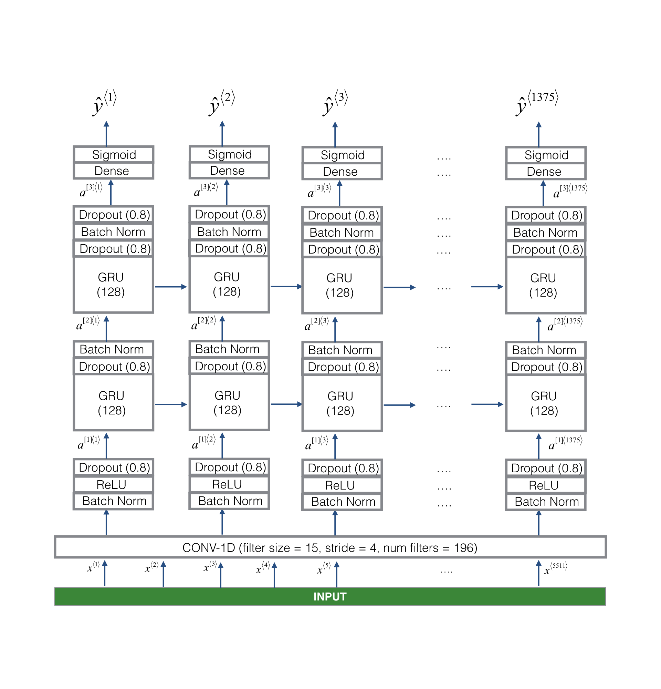

## TRIGGER WORD LILLY (Python 3.5, Tensorflow LATEST)

- Code generates required training data from given positive, negative and background samples.
- Total number of 2000 samples are generated
- MODEL

