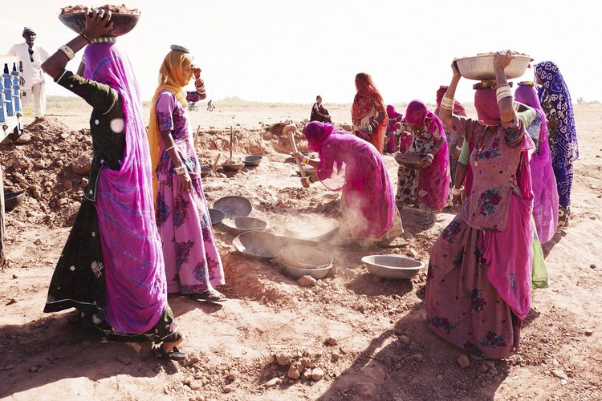
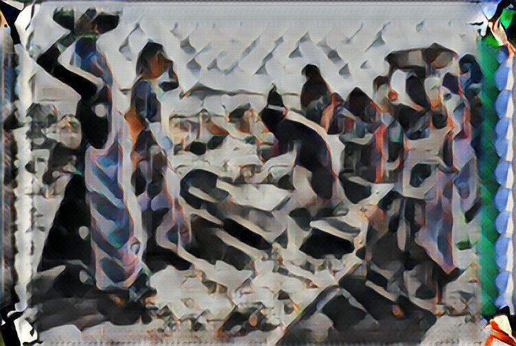

## VGG19-STYLE-TRANSFER FOR VIDEO (Python 3.5, Tensorflow LATEST)
   * https://arxiv.org/abs/1708.04538 <br />
   * Download model weights from http://www.vlfeat.org/matconvnet/models/beta16/imagenet-vgg-verydeep-19.mat <br />
   * Download COCO training images from http://msvocds.blob.core.windows.net/coco2014/train2014.zip <br />
   * Trained model to download https://drive.google.com/file/d/1cr3S_1GNLLkAtpJ1Cnf0HJi1aZmMUT8i/view?usp=sharing
      
   ### * Training
```
python style-transfer-Noise-train.py --style imgstyle\udnie.jpg --chkpnt chkpnt_udnie_batch_16\ --test-image testImage\Kishwar.jpg --print-iterations 500 --chkpnt-iterations 2000 --epochs 3 --learning-rate 0.001 --batch-size 16 --content D:\train2014\train2014\
```

   ### * Testing (Image)
```
python style-transfer-Noise-test.py --chkpnt chkpnt_udnie_batch_16\ --cam-url 255 --in-path testImage\ContentImage.jpg --out-path output\Output.jpg
```
<p align = 'center'>


<a href = 'output/Output.jpg'></a>
</p>

   ### * Testing (Video) - Using IP Camera
```
python style-transfer-Noise-test.py --chkpnt chkpnt_udnie_batch_16\ --cam-url http://192.168.0.3:8080/video/
```

   ### * Testing (Video) - Using Laptop Camera
```
python style-transfer-Noise-test.py --chkpnt chkpnt_udnie_batch_16\ --cam-url 0
```
